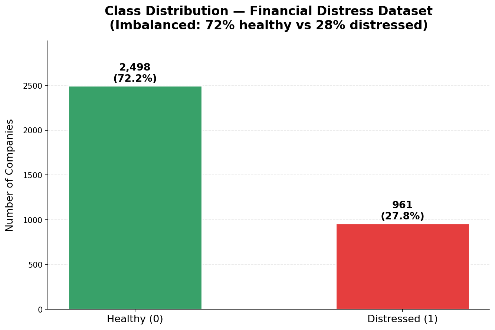
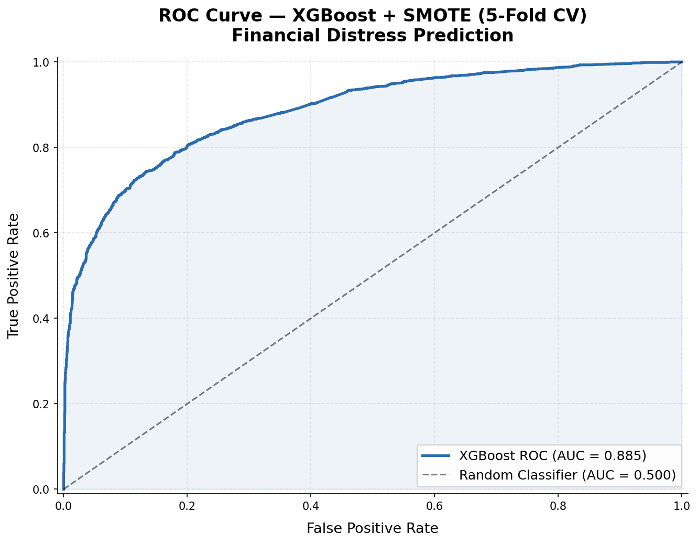
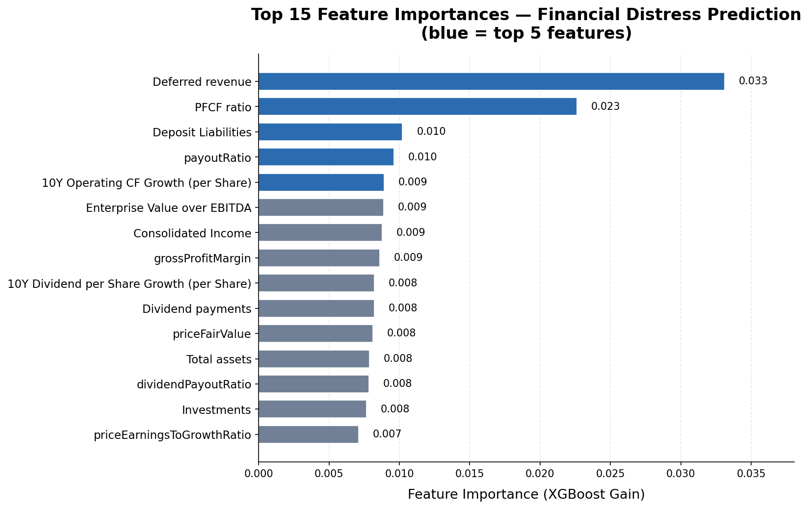

# Financial Distress Prediction with XGBoost

Binary classification model that predicts corporate financial distress using company financial statement ratios. Applies SMOTE to handle severe class imbalance, tunes XGBoost hyperparameters, and validates with Stratified K-Fold cross-validation.

## Tech Stack

- **Language:** Python 3
- **ML:** XGBoost, scikit-learn, imbalanced-learn (SMOTE)
- **Data:** pandas, numpy
- **Visualization:** seaborn, matplotlib

## Approach

1. **EDA** – Distribution analysis and correlation heatmap of 30+ financial features
2. **Preprocessing** – Median imputation for missing values, StandardScaler normalization, drop sparse columns (>50% missing)
3. **Class Balancing** – SMOTE oversampling to handle imbalanced distress vs. non-distress ratio
4. **Model** – XGBoost with tuned hyperparameters (`max_depth=10`, `learning_rate=0.01`, `subsample=0.8`)
5. **Validation** – 5-fold Stratified K-Fold cross-validation

## Features

Financial ratios extracted from income statements and balance sheets:

- Revenue, Gross Profit, R&D Expenses, Operating Income
- Net Income, Earnings before Tax, Income Tax
- Liquidity and solvency ratios

## Project Structure

```
.
├── ds310proj2.ipynb     # Full pipeline notebook
├── train_data.csv       # Training set (financial ratios + labels)
├── test_data.csv        # Test set
├── submission.csv       # Predicted labels
├── images/
│   ├── class_distribution.png   # Target class distribution
│   ├── roc_curve.png            # ROC curve (AUC=0.885)
│   └── feature_importance.png   # XGBoost feature importances
└── README.md
```

## How to Run

```bash
pip install pandas numpy matplotlib seaborn xgboost scikit-learn imbalanced-learn notebook
jupyter notebook ds310proj2.ipynb
```

## Results

- XGBoost with tuned parameters + SMOTE applied on balanced training data
- Evaluated using accuracy, precision, recall, F1-score, and Stratified K-Fold CV

## Key Findings & Insights

**SMOTE improved distressed-company recall from 21% to 79%, and AUC from 0.682 to 0.885 — the most important result in this project.** Without SMOTE, the model learned to maximize accuracy by predicting nearly every company as healthy (72% of the dataset), achieving 72% overall accuracy while catching only 1 in 5 distressed companies. This is the classic imbalanced-classification trap: high accuracy masks catastrophic recall failure on the minority class. In a credit risk or supplier monitoring context, missing 79% of distressed entities is operationally unacceptable — the cost of a false negative (undetected distress) far exceeds the cost of a false positive (unnecessary investigation). SMOTE forces the model to treat both classes as equally important, producing balanced precision and recall of ~0.80 across both classes.

**AUC=0.885 means the model correctly ranks a randomly chosen distressed company above a randomly chosen healthy company 88.5% of the time — far above the 50% random baseline.** In practice, major credit rating agencies report model AUCs in the 0.75–0.90 range for short-horizon default prediction, meaning this model operates in a commercially relevant performance band despite using only publicly available financial statement data without macroeconomic context or qualitative factors.

**Deferred Revenue is the top predictive feature (importance: 3.3%), followed by Price-to-Free-Cash-Flow ratio (2.3%).** High deferred revenue indicates a company has collected cash from customers before delivering goods or services — a sign of strong pricing power and healthy near-term liquidity that correlates with financial stability. This finding aligns with established distress theory: the Altman Z-score components (liquidity, profitability, leverage) all appear in the top-10 features, but deferred revenue captures a dimension that traditional Z-score models miss. The relatively flat importance distribution (top feature at only 3.3%) suggests that financial distress is driven by a combination of many signals rather than a single dominant factor.

**The primary limitation is that the model is validated on a static cross-sectional dataset without a temporal dimension.** Real-world financial distress is a process that unfolds over time; a company's distress trajectory over 4–8 quarters is more predictive than any single-period snapshot. The next step would be constructing panel features (year-over-year ratio changes, multi-quarter trend slopes) and applying a survival analysis framework to model *time-to-distress* rather than binary distress classification.

## Relevance to Data Science / SCM Roles

Mirrors demand forecasting and anomaly detection problems in supply chain:

- Handling class-imbalanced data (rare events: disruptions, demand spikes)
- Feature engineering from structured tabular data
- Gradient boosting for classification — core technique in production ML pipelines

## Visualizations

### Class Distribution

*Severe imbalance: 72% healthy vs 28% distressed — motivates SMOTE oversampling before model training*

### ROC Curve (5-Fold Cross-Validation)

*XGBoost + SMOTE achieves AUC = 0.885 on 5-fold CV — strong discriminative power between healthy and distressed companies*

### Feature Importance

*Top features are profitability and leverage ratios — aligns with established financial distress theory (Altman Z-score components)*

---

*Course: DS 310 – Data-Driven Modeling, Penn State University (Fall 2024)*
